# Frontend Mentor - Multi-step form

This is a solution to the [Multi-step form challenge on Frontend Mentor](https://www.frontendmentor.io/challenges/multistep-form-YVAnSdqQBJ). Allows users to fill out a multi-step form for a game subscription.

## Table of contents

- [Overview](#overview)
  - [The challenge](#the-challenge)
  - [Screenshots](#screenshots)
    - [Responsive Layout](#responsive-layout)
    - [Multi-step form](#multi-step-form)
      - [Steps](#steps)
        - [1. Personal Info](#1-personal-info)
        - [2. Select Plan](#2-select-plan)
        - [3. Pick Add-ons](#3-pick-add-ons)
    - [Forms Validation](#forms-validation)
      - [1. Personal Info Validation](#1-personal-info-validation)
      - [1. Select Plan Validation](#2-select-plan-validation)
    - [Hover states](#hover-states)
  - [Tests](#tests)
    - [Unit and Integration Tests](#unit-and-integration-tests)
    - [E2E Tests](#e2e-tests)
    - [Accessibility Tests](#accessibility-tests)
  - [Links](#links)
  - [My process](#my-process)
    - [Built with](#built-with)
    - [What I learned](#what-i-learned)
- [Author](#author)

## Overview

### The challenge

Users should be able to:

- Complete each step of the sequence
- Go back to a previous step to update their selections
- See a summary of their selections on the final step and confirm their order
- View the optimal layout for the interface depending on their device's screen size
- See hover and focus states for all interactive elements on the page
- Receive form validation messages if:
  - A field has been missed
  - The email address is not formatted correctly
  - A step is submitted, but no selection has been made

Additional features:

- Receive form validation messages if:
  - The name field contains characters other than letters and spaces
  - The name field has less than 2 characters or more than 50 characters

### Screenshots

#### Responsive Layout

This project features a responsive design, built with with a "mobile-first" approach.

1. Mobile layout

   1.1 Small Screens

      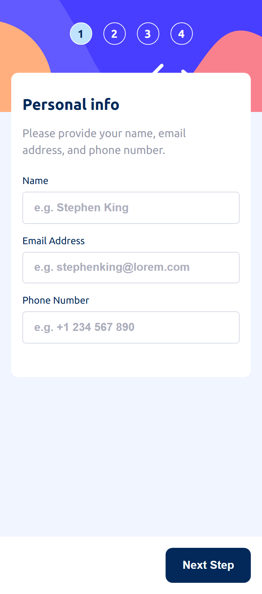

   1.2 Tablet Screens

      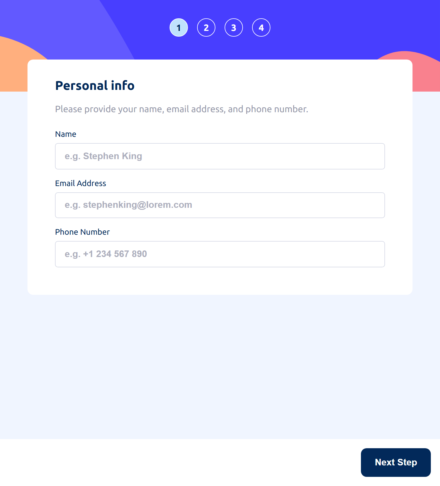

2. Desktop layout

   

#### Multi-step form

##### Steps

###### 1. Personal Info

The first form step is the Personal Info form, the user needs to provide their name, email address, and phone number.

###### 2. Select Plan

The second form step is the Select Plan form, the user needs to choose a plan.

When a plan is selected, it stays highlighted:

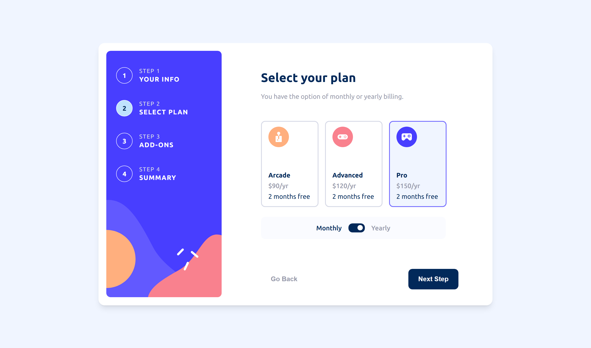

By default, the yearly subscription is selected. If the user wants to change to monthly, just needs to click the toggle button and the monthly pricing is applied:

Clicking the "Go Back" button allows the user to return to the previous form step, where the submitted data is displayed. For example, going back to the first step:

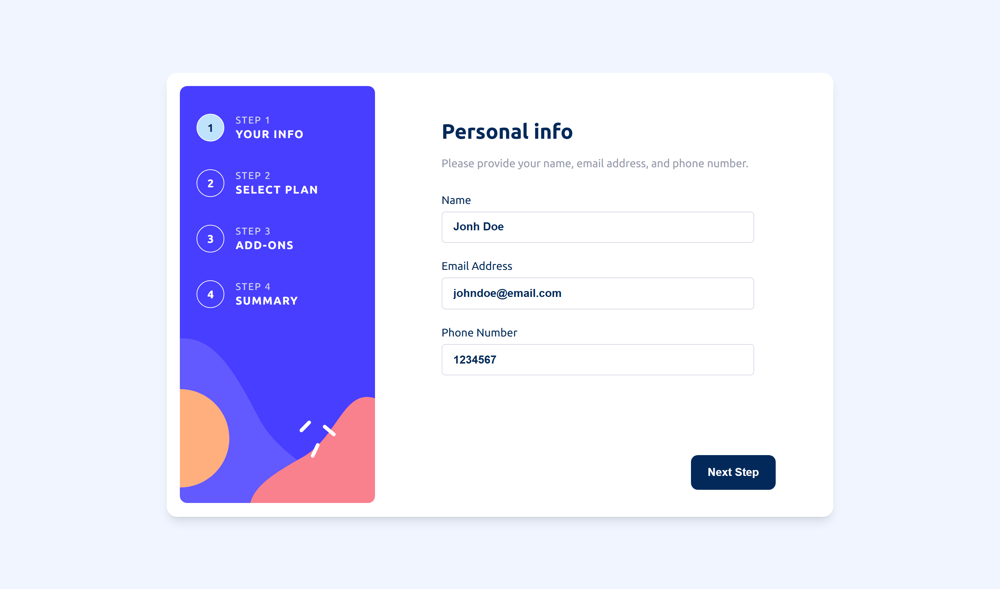

###### 3. Pick Add-ons

The final form step is the Pick Add-ons form, where the user can choose the add-ons for the subscription.

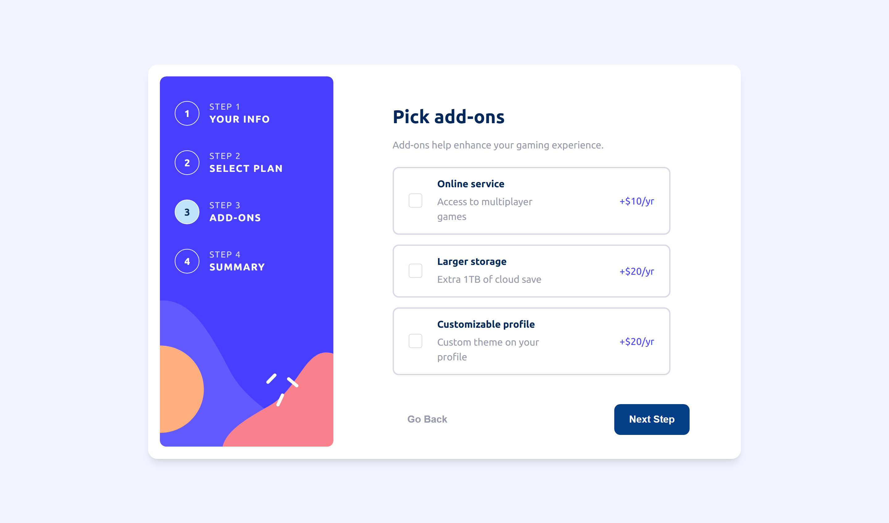

Like the plan, selected add-ons stay highlighted:

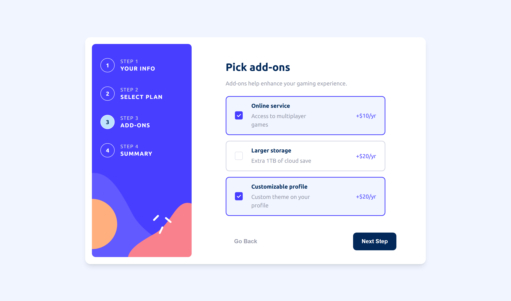

After the last form submision, the user is redirected to a confirmation screen to review the filled-out data:

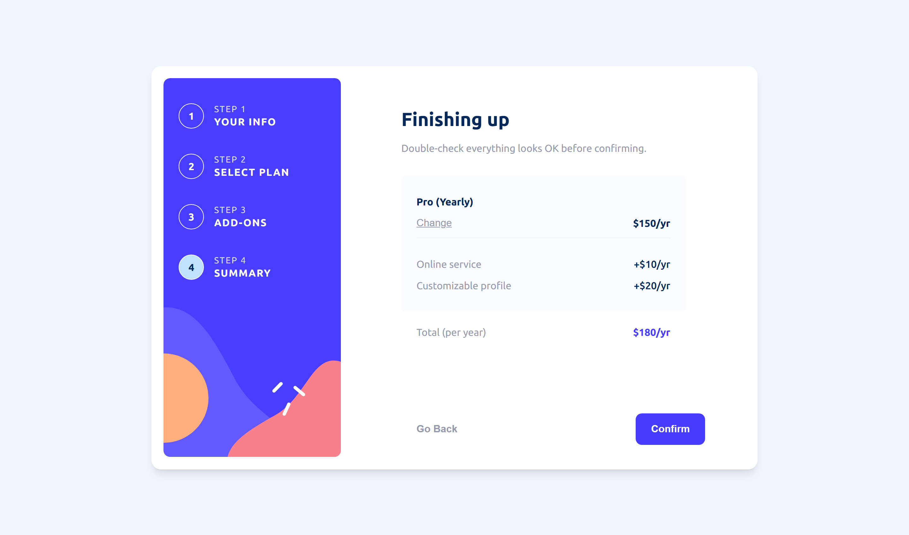

On this screen, the user can click the "Change" button to be redirected to the Select Plan form step, or click the "Confirm" button to be redirected to the thank-you screen:

##### Forms Validation

This projects uses React Hook Form to validate and display error messages in the form steps: Personal Info and Select Plan

###### 1. Personal Info Validation

- If a field is missing:

  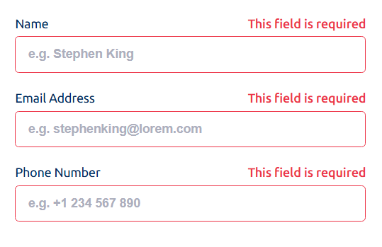

Name field:

- If it has less than 2 characters:

  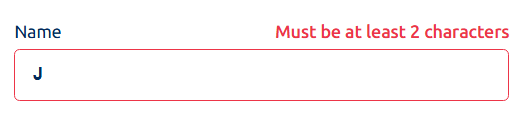

- If it has more than 50 characters:

  

- If contains characters other than letters and spaces the message:

  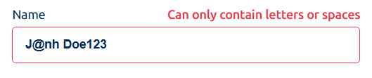

Email Address field:

- If doesn't match the valid format:

  

Phone Number field:

- If doesn't match a valid format like +351 123456789; +1-(800)-123-4567; (926) 1234567; 1234567; 123-4567:

  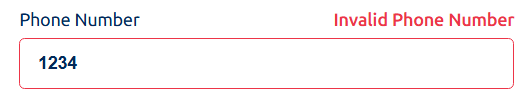

###### 2. Select Plan Validation

- If no plan is selected:

  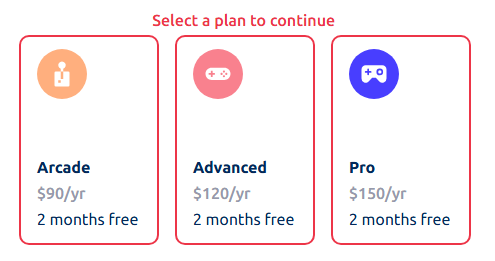

#### Hover states

##### 1. Personal info form

Name field with hover state:

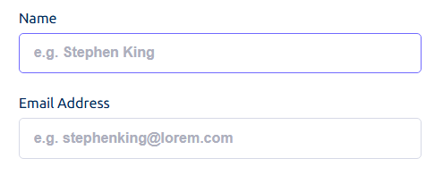

##### 2. Select Plan form

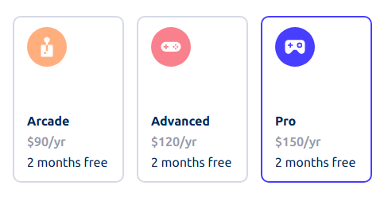

##### 3. Confirmation screen - "Change" button

Default state:

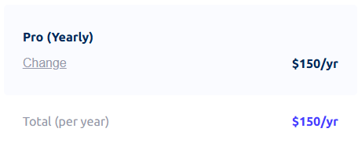

Hover state:

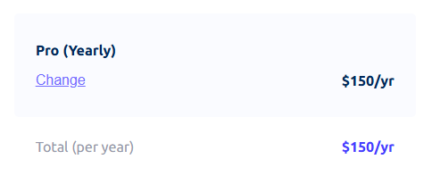

##### 4. Steps navigation buttons

Default/Hover state:

"Go Back" button:

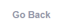

"Next Step" button:

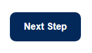

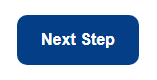

"Confirm" button:

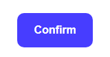

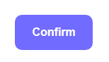

### Tests

#### **Unit and Integration Tests**

This project uses Jest and React Testing Library for unit and integration testing.

The unit tests cover:

- The rendering of the components
- The function formatYearlyOrMonthlyPrice, used to format the price in the Select Plan, Pick Add-ons and Finishing Up screens

The integration tests cover:

For the Personal info form step:

- Displaying the message "This field is required" for the empty fields
- Displaying the message "Must be at least 2 characters" if the Name field has less than 2 characters
- Displaying the message "Must be under 50 characters" if the Name field has more than 50 characters
- Displaying the message "Can only contain letters or spaces" if the Name field is invalid
- Displaying the message "Invalid Email Address" if the Email Address field is invalid
- Displaying the message "Invalid Phone Number" if the Phone Number field is invalid

For the Select plab form step:

- Displaying the message "Select a plan to continue" is no plan is selected
- Allowing the user to toggle between monthly or yearly subscription

#### **E2E Tests**

This project uses Playwright for end to end testing.

The E2E tests cover:

1. Mobile only (Pixel 5 and iPhone 12):

- Displaying the steps list with the index for each step

2. Desktop only (Chromium, Firefox and Webkit):

"displays the steps list with index and name for each step"

- Displaying the steps list with the index and name for each step

3. All viewport tests:

- Not allowing the user to go to the next step if the current step has an invalid field
- All form steps Keep the submitted form data

After completing the Multi-step form:

- Displaying the "Finishing up" screen with a summary of the entered form data
- Allowing the user to go back to the "Select Plan" for step when clicking on the "Change" button in the "Finishing up" screen
- Allowing the user togo to the "Thank you" screen when clicking on the "Confirm" button in the "Finishing up" screen

#### **Accessibility Tests**

1. Automated Tests

- Run Lighthouse audits in Chrome and Edge DevTools (96 score - related to the text font color and form background color).

2. Manual Tests

- Screen Reader testing with NVDA:
  - Checked that headings (h1, h2) are announced correctly.
  - Checked that the main headings (h1) are automatically announced when changing from one form step to another, to let know the users that a new form step is being displayed.
  - Checked that the steps list is not announced.
  - Checked that all section content is announced correctly.
  - Checked that all buttons and fields are read when focused.

### Links

- Solution URL: [https://github.com/f29pereira/multi-step-form](https://github.com/f29pereira/multi-step-form)
- Live Site URL: [https://f29pereira.github.io/multi-step-form/](https://f29pereira.github.io/multi-step-form/)

### Built with

- Semantic HTML5 markup
- CSS custom properties
- Flexbox
- Grid
- Mobile-first workflow
- TypeScript
- [Next.js](https://nextjs.org/) - React framework
- [React](https://reactjs.org/) - JavaScript library
- [React Context API](https://react.dev/reference/react/createContext) - React API that allows to share state across components without prop drilling
- [React Developer Tools](https://react.dev/learn/react-developer-tools) - browser extension
- [React Hook Form](https://react-hook-form.com/) - Library that helps build performant, flexible and extensible forms with easy-to-use validation
- [clsx](https://www.npmjs.com/package/clsx) - Utility for constructing className strings conditionally
- [Jest](https://jestjs.io/) - JavaScript testing library
- [React Testing Library](https://testing-library.com/) - React components testing library
- [user-event](https://www.npmjs.com/package/@testing-library/user-event) - companion library of the React Testing Library
- [Playwright](https://playwright.dev/) - Automation library for end-to-end testing
- [NVDA (NonVisual Desktop Access)](https://www.nvaccess.org/) - Open-source screen reader for Windows

### What I learned

- Use a list of components (form step related components) to de displayed one by one in the main form component MultiStepForm
- Use the React Hook Form library to validate and display error messages for the form steps
- Avoid potential hydration errors that occasionally occur during the Playwright tests (browsers: webkit and safari) by using the Playwrtight's method click(), to check if the inputs of the first form step where ready to be filled in.

## Author

- Frontend Mentor - [@f29pereira](https://www.frontendmentor.io/profile/f29pereira)
